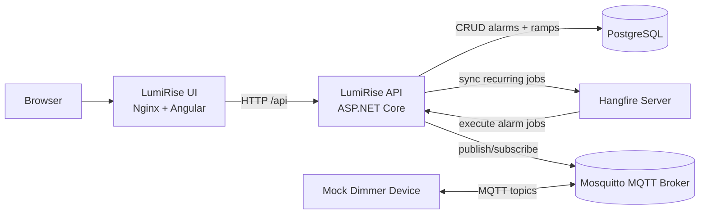
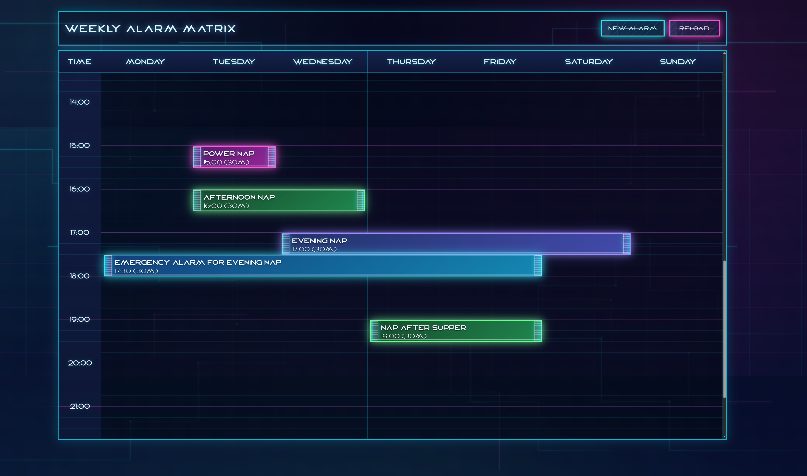

# LumiRise

LumiRise is a wake-up light scheduler. It stores alarm schedules, triggers alarm ramps via Hangfire jobs, and controls a dimmer over MQTT.

## Project Outline

- `src/LumiRise.Api`: ASP.NET Core API, EF Core migrations, Hangfire scheduling, MQTT-based alarm execution.
- `src/LumiRise.Ui`: Angular web frontend served by Nginx.
- `src/LumiRise.MockDimmerDevice`: Mock MQTT dimmer for local end-to-end testing.
- `src/LumiRise.Tests`: Unit tests.
- `src/LumiRise.IntegrationTests`: Integration tests for API, scheduling, and MQTT behavior.
- `docker-compose.yml`: Local runtime stack for UI, API, Postgres, MQTT broker, and mock dimmer.

## Component Interplay



## Run with Docker Compose

Prerequisites:

- Docker Engine with Compose plugin (`docker compose`).

Start all services from the repository root:

```bash
docker compose up -d --build
```

Open:

- UI: `http://localhost:8081`
- API Swagger: `http://localhost:8080/swagger`
- Hangfire Dashboard: `http://localhost:8080/hangfire`

Stop and remove containers:

```bash
docker compose down
```

Notes:

- The UI container reads `BACKEND_URL` at container startup (`docker-compose.yml` defaults it to `http://lumi-rise:8080`).
- API uses Postgres (`postgres-db`) and MQTT broker (`mqtt-broker`) from the same Compose network.

## Cyberpunk inspired Web-UI

