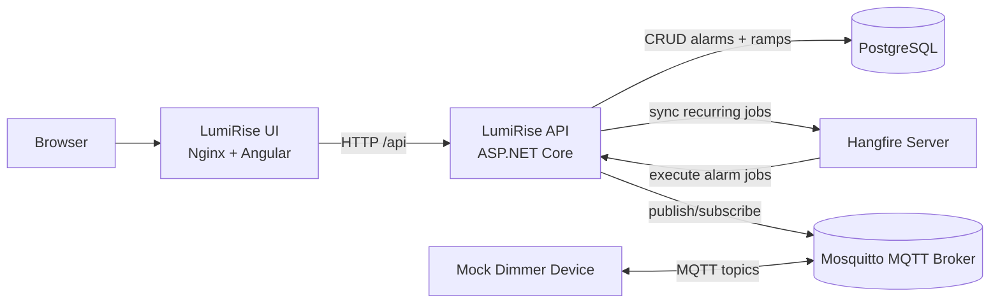

# LumiRise

LumiRise is a wake-up light scheduler. It stores alarm schedules, triggers alarm ramps via Hangfire jobs, and controls a dimmer over MQTT.

## Project Outline

- `src/LumiRise.Api`: ASP.NET Core API, EF Core migrations, Hangfire scheduling, MQTT-based alarm execution.
- `src/LumiRise.Ui`: Angular web frontend served by Nginx.
- `src/LumiRise.MockDimmerDevice`: Mock MQTT dimmer for local end-to-end testing.
- `src/LumiRise.Tests`: Unit tests.
- `src/LumiRise.IntegrationTests`: Integration tests for API, scheduling, and MQTT behavior.
- `docker-compose.yml`: Local runtime stack for UI, API, Postgres, MQTT broker, and mock dimmer.

## Component Interplay



## Run with Docker Compose

Prerequisites:

- Docker Engine with Compose plugin (`docker compose`).

Start all services from the repository root:

```bash
docker compose up -d --build
```

Open:

- UI: `http://localhost:8081`
- API Swagger: `http://localhost:8080/swagger`
- Hangfire Dashboard: `http://localhost:8080/hangfire`

Stop and remove containers:

```bash
docker compose down
```

Notes:

- The UI container reads `BACKEND_URL` at container startup (`docker-compose.yml` defaults it to `http://lumi-rise:8080`).
- API uses Postgres (`postgres-db`) and MQTT broker (`mqtt-broker`) from the same Compose network.

## Deployment (amd64 local + arm64 Raspberry Pi)

This repository includes a `Makefile` to avoid memorizing long `docker buildx` commands.

Prerequisites:

- Docker Engine with Compose plugin.
- Docker Buildx (`docker buildx version`).
- Access to your container registry (`docker login <registry>`).
- `.env` configured with `REGISTRY` and `APP_VERSION`.

Local amd64 workflow:

```bash
make local-build
make local-up
make local-down
```

`docker-compose.yml` is pinned to `linux/amd64` for local testing.

Release workflow (publish amd64 + arm64 and create multi-arch manifests):

```bash
set -a; . ./.env; set +a
docker login "$REGISTRY"
make release
```

`make release` performs:

- `amd64` and `arm64` image builds for `lumi-rise` and `lumi-rise-ui`.
- Push of architecture-specific tags:
  - `${REGISTRY}/lumi-rise:${APP_VERSION}-amd64`
  - `${REGISTRY}/lumi-rise:${APP_VERSION}-arm64`
  - `${REGISTRY}/lumi-rise-ui:${APP_VERSION}-amd64`
  - `${REGISTRY}/lumi-rise-ui:${APP_VERSION}-arm64`
- Creation/update of multi-arch manifest tags:
  - `${REGISTRY}/lumi-rise:${APP_VERSION}`
  - `${REGISTRY}/lumi-rise-ui:${APP_VERSION}`

Optional split targets:

```bash
make release-api
make release-ui
make release-manifest
```

Verify published manifests:

```bash
set -a; . ./.env; set +a
docker buildx imagetools inspect "${REGISTRY}/lumi-rise:${APP_VERSION}"
docker buildx imagetools inspect "${REGISTRY}/lumi-rise-ui:${APP_VERSION}"
```

Raspberry Pi deployment:

```bash
docker compose -f docker-compose.production.yaml pull
docker compose -f docker-compose.production.yaml up -d --no-build
```

`docker-compose.production.yaml` pins `lumi-rise` and `lumi-rise-ui` to `platform: linux/arm64`.

## Cyberpunk inspired Web-UI


